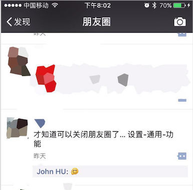

#微信，真是一个了不起的产品

最近看到朋友A的朋友圈,才知道原来可以关闭朋友圈。😄，同时突然对这个问题产生了思考。

##为什么会有关闭朋友圈这个功能？

结合我自己的使用习惯，要让我关闭朋友圈，我想原因有几点：
> * 不自觉的会打开朋友圈，查看朋友状态。
> * 因为朋友圈更新的频率很快，导致会突然停下工作去查看一下朋友圈。又或者在排队，在吃饭，甚至在拉屎也会想起看看朋友圈，因此占据了大量的时间。
> * 常常看到无聊的自拍以及图文不符，略带有装逼的信息。除了手动拉黑个人就是不看朋友圈了。
> * 点了一个赞就会一整天都有红点提示！提示我，我关心的信息有更新了。
>

产生这些原因，主要是因为自己平时是不怎么发朋友圈的，都是浏览朋友圈的内容为多。而朋友圈的朋友每天都可以提供很多可供阅读的内容。这里可以看到朋友圈的功能分类很明确，分为以下几种：

> * 消费朋友圈的内容 ：
> 上面说的就是这种人，aka,My 
> * 创造朋友圈的内容 :
> 好友，陌生好友（提供装修，旅游等咨询的人），还有微信广告。
> * 熟悉新朋友。

朋友A 应该也是有和我一样的烦恼。（FYI ,我没有关闭朋友圈）
这么一看，容易使用户反感的是作为消费朋友圈内容的人，因此微信有了关闭朋友圈这个功能。

##微信是怎么做的？

设置 -> 通用 -> 功能 -> 朋友圈 ，点击停用就可以关闭朋友圈了。

关闭朋友圈之后，基本上断绝了内容消费者的使用方式，用户不会不自觉的就查看无用的信息。从原本的：发现 -> 朋友圈 -> 发送内容，入口变成: 点击头像 -> 进入朋友圈  ->  发送内容。从产品的角度说，就是增加了用户的操作成本，也因此降低了用户没事就想发发朋友圈的欲望。

关闭朋友圈，用户还是可以继续发状态，也可以浏览朋友的状态以及可以查看朋友的timeline。这巧妙的设计，实在是🐂！

我相信就算朋友A关闭了朋友圈，每逢节日他会偷偷的发状态，发评论. 或者偷偷查看某位新朋友的timeline.

